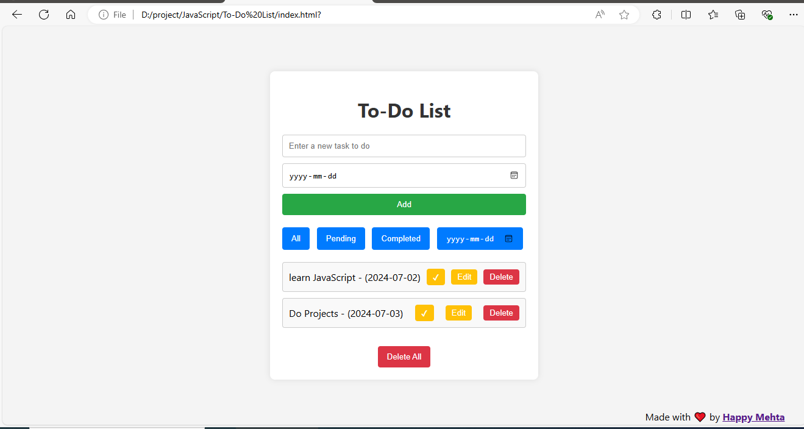

# Advanced To-Do List Web App

## Description

The Advanced To-Do List Web App helps manage daily tasks efficiently. Create, edit, delete, filter by status and date, mark as done, and delete all tasks. Built with HTML, CSS, and JavaScript for a responsive and interactive user experience.

## Features

- **Add New Tasks:** Easily add new tasks with a description and due date.
- **Edit Tasks:** Modify task details, including the description and due date.
- **Delete Tasks:** Remove individual tasks that are no longer needed.
- **Mark Tasks as Completed:** Tick off tasks as you complete them.
- **Filter Tasks:** View all tasks, only pending tasks, only completed tasks, or tasks by specific dates.
- **Delete All Tasks:** Clear all tasks with a single click.
- **Responsive Design:** Enjoy a seamless experience on both desktop and mobile devices.
## WebSite Link

https://happymehta.github.io/Advanced-To-Do-List-Web-App/

## Screenshots


*Figure 1: Main Interface of the To-Do List Web App*


## Getting Started

To get a local copy up and running, follow these simple steps.

### Prerequisites

Ensure you have a modern web browser installed.

### Installation

1. **Clone the repository:**
   ```bash
   git clone https://github.com/yourusername/advanced-todo-list-web-app.git

2. Navigate to the project directory:
    ```bash
    cd advanced-todo-list-web-app


## Running the App

1. Open the HTML file:
* Simply double-click on `index.html` or open it in your web browser.

## Usage

1. **Add a Task:**
* Enter a task description and due date in the input fields, then click "Add".

2. **Edit a Task:**
* Click the "Edit" button next to the task, modify the details, and save.

3. **Delete a Task:**
* Click the "Delete" button next to the task you want to remove.

4. **Mark a Task as Completed:**
* Click the "✔" button next to the task to mark it as completed.

5. **Filter Tasks:**
* Use the filter buttons to view all tasks, pending tasks, completed tasks, or tasks by date.

6. **Delete All Tasks:**
* Click the "Delete All" button to clear the entire task list.

## Contributing

Contributions are what make the open-source community such an amazing place to learn, inspire, and create. Any contributions you make are **greatly appreciated**.

1. Fork the Project
2. Create your Feature Branch (`git checkout -b feature/AmazingFeature`)
3. Commit your Changes (`git commit -m 'Add some AmazingFeature'`)
4. Push to the Branch (`git push origin feature/AmazingFeature`)
5. Open a Pull Request

## License

Distributed under the MIT License. See `LICENSE` for more information.

## Contact

Your Name - happymehta1551@gmail.com

Project Link: https://github.com/HappyMehta/Advanced-To-Do-List-Web-App.git

## Acknowledgements

* [Font Awesome](https://fontawesome.com)
* [Google Fonts](https://fonts.google.com)
* [Unsplash](https://unsplash.com) for placeholder images
* [CSS Tricks](https://css-tricks.com) for CSS inspiration
